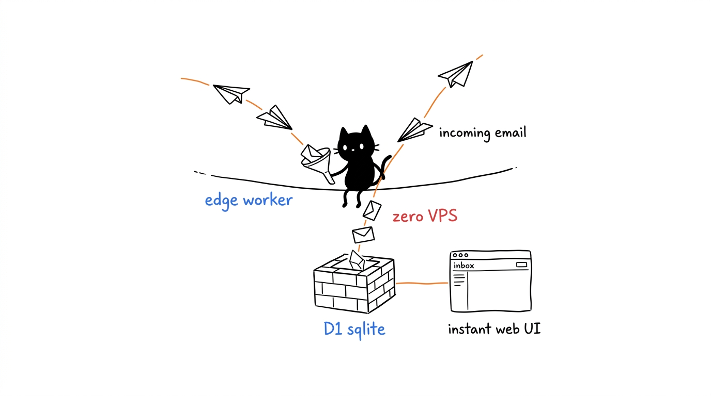
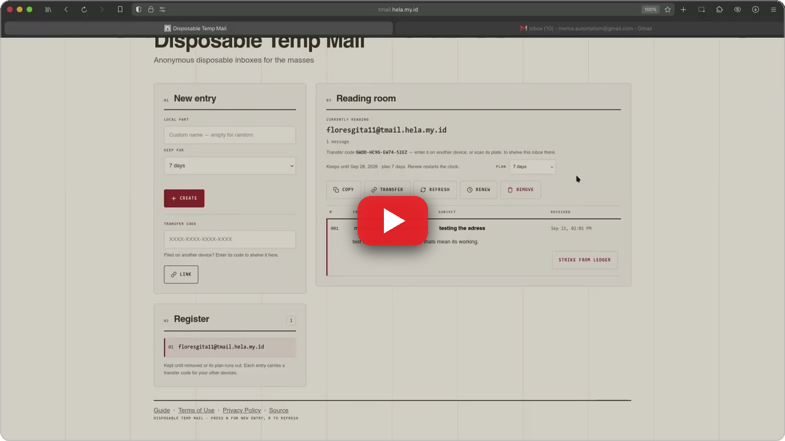
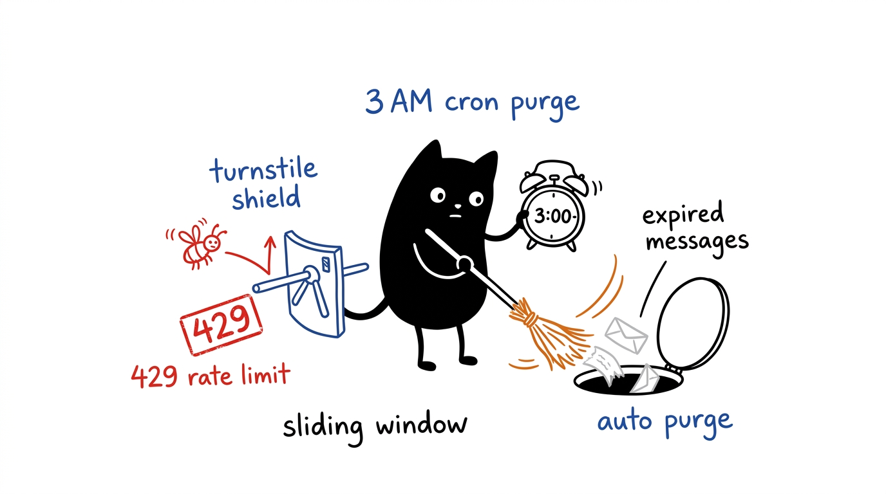

# Disposable Temp Mail on Cloudflare Workers

A **self-hosted disposable email** service that runs entirely on **Cloudflare Workers** — no VPS required. It receives inbound mail through Cloudflare Email Workers, stores messages in D1, and serves a clean web UI from the edge.

---

## Table of Contents

- [How it works](#how-it-works)
- [Prerequisites](#prerequisites)
- [Setup Guide](#setup-guide)
  - [Step 1 — Clone & install dependencies](#step-1--clone--install-dependencies)
  - [Step 2 — Login to Cloudflare](#step-2--login-to-cloudflare)
  - [Step 3 — Create your wrangler.toml](#step-3--create-your-wranglertoml)
  - [Step 4 — Create the D1 database](#step-4--create-the-d1-database)
  - [Step 5 — Apply the database schema](#step-5--apply-the-database-schema)
  - [Step 6 — Deploy the Worker](#step-6--deploy-the-worker)
  - [Step 7 — Setup DNS on Cloudflare](#step-7--setup-dns-on-cloudflare)
  - [Step 8 — Test it](#step-8--test-it)
- [Commands cheat sheet](#commands-cheat-sheet)
- [Project structure](#project-structure)
- [Tech stack](#tech-stack)
- [Abuse controls & retention](#abuse-controls--retention)
- [Tests](#tests)
- [Troubleshooting](#troubleshooting)
- [Documentation](#documentation)
- [License](#license)

---

## How it works



```
Sender → Cloudflare MX → Email Worker (email handler)
                                  │
                                  ▼
                          D1 Database (SQLite)
                                  │
                                  ▼
                   Worker HTTP handler → Web UI + API
```

- **No VPS** — everything runs on Cloudflare's edge
- **No Postfix** — Cloudflare Email Workers handle SMTP ingestion natively
- **No Docker** — just `wrangler deploy`
- **Zero cost** — fits within Cloudflare's free tier
- **Installable PWA** — add to home screen, offline app shell

<p align="center">
  <a href="https://youtu.be/ixEKTiah4Bk" target="_blank" rel="noopener noreferrer">
    
  </a>
  <br>
  <sub><b>▶️ Watch the live walkthrough & demo on YouTube</b> (click preview to play)</sub>
</p>

---

## Prerequisites

Before you start, you need:

| Requirement | Details |
|---|---|
| **Cloudflare account** | [Sign up here](https://dash.cloudflare.com/sign-up) (free) |
| **A domain** | Must be added to Cloudflare (nameservers pointed to Cloudflare) |
| **Node.js** | v18 or later ([download](https://nodejs.org/)) |
| **npm** | Comes with Node.js |

---

## Setup Guide

### Step 1 — Clone & install dependencies

```bash
git clone <your-repo-url>
cd Disposable-Temp-Mail
npm install
```

---

### Step 2 — Login to Cloudflare

```bash
npx wrangler login
```

This opens a browser window. Log in with your Cloudflare account and approve the OAuth scopes.

> **What scopes are needed?**
> Wrangler will request permissions for Workers, D1, Email Routing, Pages, and more. You must approve all of them so the CLI can create the database and deploy the worker.

Verify you're logged in:

```bash
npx wrangler whoami
```

---

### Step 3 — Create your wrangler.toml

Copy the example config and fill in your own values:

```bash
cp wrangler.example.toml wrangler.toml
```

Then edit `wrangler.toml`:

| Field | Change to |
|---|---|
| `database_id` | Leave empty for now — you'll fill it in Step 4 |
| routes `pattern` | Your web UI subdomain (e.g. `tmail.example.com`) |
| `MAIL_DOMAIN` | Your receiving domain (e.g. `example.com`) |
| `WEB_HOST` | Same as the routes pattern (e.g. `tmail.example.com`) |

> `wrangler.toml` holds your private domains and database ID — it is
> git-ignored. Only `wrangler.example.toml` (placeholders) is committed.

### Step 4 — Create the D1 database

```bash
npx wrangler d1 create disposable-temp-mail-db
```

You'll see output like:

```
✅ Successfully created DB 'disposable-temp-mail-db'

[[d1_databases]]
binding = "DB"
database_name = "disposable-temp-mail-db"
database_id = "xxxxxxxx-xxxx-xxxx-xxxx-xxxxxxxxxxxx"
```

Copy the `database_id` into your `wrangler.toml`.

---

### Step 5 — Apply the database schema

Push the schema to your **remote** D1 database on Cloudflare:

```bash
npx wrangler d1 execute disposable-temp-mail-db --remote --file=src/db/schema.sql
```

This creates six tables:
- `inboxes` — email addresses (with per-inbox `retention_days`)
- `messages` — received emails
- `sessions` — browser session tokens
- `session_inboxes` — which inboxes belong to which session
- `inbox_tokens` — cross-device transfer codes
- `rate_hits` — rate-limit counters (pruned daily)

> **Existing deployments:** re-run the command after pulling updates — the
> schema uses `CREATE TABLE IF NOT EXISTS`, so it safely adds missing tables.

> **Note:** The `--remote` flag is important — without it, the schema only applies locally. You want it on Cloudflare's servers.

---

### Step 6 — Deploy the Worker

```bash
npx wrangler deploy
```

This does three things:
1. Uploads the TypeScript Worker code
2. Uploads the static frontend files (HTML/CSS/JS) to Cloudflare Assets (edge CDN)
3. Registers the custom domain route

After a successful deploy, you'll see:

```
Deployed disposable-temp-mail triggers
  tmail.YOURDOMAIN.com (custom domain)
```

---

### Step 7 — Setup DNS on Cloudflare

#### 7a. Web UI (automatic)

Cloudflare automatically creates the DNS record for your Worker's custom domain. If it doesn't:

- Go to **Cloudflare Dashboard → Workers & Pages → disposable-temp-mail → Settings → Domains**
- The custom domain `tmail.YOURDOMAIN.com` should already be listed

#### 7b. MX Records (automatic with Email Routing)

Email Routing should already be enabled on your domain. Verify:

```bash
npx wrangler email routing settings YOURDOMAIN.com
```

It should show `Enabled: true`. The catch-all rule is also automatically set up — every `*@YOURDOMAIN.com` is routed to the `disposable-temp-mail` Worker:

```bash
npx wrangler email routing rules list YOURDOMAIN.com
```

Expected output:
```
Catch-all rule: enabled, action: worker:disposable-temp-mail
```

#### 7c. SPF Record (optional but recommended)

If you don't already have an SPF record, add one so emails don't get flagged as spam:

| Type | Name | Content |
|---|---|---|
| TXT | `@` | `v=spf1 include:_spf.mx.cloudflare.net ~all` |

---

### Step 8 — Test it

1. Open `https://tmail.YOURDOMAIN.com` in your browser
2. Click **New** → **Create** to file a random address (or type a name first for a custom one)
3. Send an email from Gmail/any provider to that address
4. Press **R** (or the refresh control) — the email appears in the register
5. Expand the entry to read it; **Strike from ledger** permanently deletes a single message

---

## Commands cheat sheet

| Command | What it does |
|---|---|
| `npm run deploy` | Deploy Worker + static assets |
| `npm run db:migrate` | Apply schema to production D1 |
| `npm run db:local` | Apply schema to local D1 (for dev) |
| `npx wrangler dev` | Run Worker locally |
| `npx wrangler tail` | Stream live logs from production |
| `npx wrangler d1 execute disposable-temp-mail-db --remote --command="SELECT * FROM messages LIMIT 10"` | Query the database |

### Check if emails are being received

```bash
npx wrangler d1 execute disposable-temp-mail-db --remote --command="SELECT * FROM messages ORDER BY received_at DESC LIMIT 5;"
```

### Watch live logs

```bash
npx wrangler tail --format pretty
```

Then send a test email — you'll see the Worker processing it in real time.

---

## Project structure

```
disposable-temp-mail/
├── wrangler.example.toml      # Template config (copy to wrangler.toml, git-ignored)
├── package.json
├── tsconfig.json
├── .gitignore
├── docs/                      # Dedicated documentation & visual guides
│   ├── API.md                 # Complete REST API reference
│   ├── SECURITY.md            # Security policy and scope notes
│   ├── CHANGELOG.md           # Project changelog
│   └── assets/                # Blotcat architectural illustrations
└── src/
    ├── index.ts               # Entry point: fetch() + email() + scheduled() handlers
    ├── cleanup.ts             # Daily retention purge (messages, inboxes, sessions)
    ├── email-handler.ts       # Parses inbound email via PostalMime → D1
    ├── api/
    │   └── routes.ts          # Hono router: /api/config, /api/session, /api/inboxes, /api/messages
    ├── db/
    │   ├── schema.sql         # D1 tables (inboxes, messages, sessions, session_inboxes, rate_hits)
    │   └── queries.ts         # Typed query functions
    ├── utils/
    │   ├── random-address.ts  # Human-like random email generator
    │   └── rate-limit.ts      # D1-backed sliding-window rate limiter
    └── web/
        ├── index.html         # Frontend UI
        ├── app.js             # Frontend logic (vanilla JS)
        └── styles.css         # Dark theme styles
```

---

## Tech stack

| Layer | Tech |
|---|---|
| **Runtime** | Cloudflare Workers |
| **Router** | Hono |
| **Email parsing** | PostalMime |
| **Database** | Cloudflare D1 (SQLite) |
| **Static hosting** | Cloudflare Workers Assets (edge CDN) |
| **Language** | TypeScript |
| **CLI** | Wrangler v4 |

---

## Abuse controls & retention



- **Rate limits** (per hour, tunable in `wrangler.toml`): 20 inbox creations
  per session, 30 inbox creations per IP, 10 new sessions per IP, 30 transfer-code
  claims per IP. Exceeded requests get `429` with `Retry-After` and
  `X-RateLimit-*` headers.
- **Bot gate (recommended for public instances):** inbox creation can require a
  [Cloudflare Turnstile](https://dash.cloudflare.com/?to=/:account/turnstile)
  token. Create a widget for your web host (Managed mode), then:
  ```bash
  npx wrangler vars set TURNSTILE_SITE_KEY    # Site Key (public)
  npx wrangler secret put TURNSTILE_SECRET_KEY  # Secret Key (never commit this)
  npx wrangler deploy
  ```
  The gate stays dormant until both are set.
- **Retention:** each inbox carries its own keep-for plan — 7, 30, or 90 days,
  or keep-until-removed — chosen at creation and changeable later (the reader
  also offers Renew to restart the clock). A daily cron (`0 3 * * *`) deletes
  inboxes past their plan together with their remaining messages, every
  message older than 90 days whatever the plan, sessions older than
  30 days, and stale rate-limit rows.
  Individual messages can also be struck from the ledger anytime — permanent
  and immediate, no waiting for the purge.

---

## Tests

Zero-dependency suite on Node's built-in runner with an in-memory SQLite
D1 shim (`src/test-helpers.ts`) — covers address generation, rate limiting,
queries, retention purge, and email parsing:

```bash
npm test
```

---

## Troubleshooting

### "This site can't be reached / DNS_PROBE_FINISHED_NXDOMAIN"

Your domain's nameservers are not pointed to Cloudflare, or the DNS record hasn't propagated yet. Check:

```bash
dig +short YOURDOMAIN.com NS
```

Should show `*.ns.cloudflare.com`. Propagation can take up to 24 hours after changing nameservers.

### Emails not appearing in the web UI

1. The email was received but the inbox hasn't been linked to your browser session. Click **New** → type the exact username → **Create** to file it (or paste its transfer code into the Link field).
2. Check the database:
   ```bash
   npx wrangler d1 execute disposable-temp-mail-db --remote --command="SELECT * FROM messages ORDER BY received_at DESC LIMIT 5;"
   ```
3. Check live logs:
   ```bash
   npx wrangler tail --format pretty
   ```

### "Unexpected fields found in top-level field: email"

This is a known wrangler warning — it's cosmetic. The `[email]` config works fine. Cloudflare is still stabilizing the Email Worker integration.

### Wrangler version mismatch

This project uses **Wrangler v4**. If you're on v3:

```bash
npm install --save-dev wrangler@4
```

---

## Documentation

Comprehensive project documentation, security guides, and API contracts live in the [`docs/`](./docs/) directory:

- [**REST API Reference**](./docs/API.md) — All endpoints (`/api/session`, `/api/inboxes`, `/api/messages`), authentication headers, rate limits, and cURL workflows.
- [**Security Policy & Boundaries**](./docs/SECURITY.md) — Vulnerability reporting protocol and disposable threat model.
- [**Changelog**](./docs/CHANGELOG.md) — Version history and release notes.
- [**Architectural Illustrations**](./docs/assets/disposable-temp-mail-illustrations/) — Hand-drawn 16:9 Blotcat system guides.

---

## License

MIT — see [LICENSE](./LICENSE).
