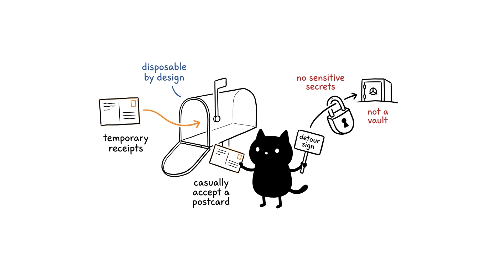

# Security Policy

## Reporting a Vulnerability

Report security issues via **GitHub Security Advisories** on this repository
(`Security` → `Report a vulnerability`). Do not open a public issue for
sensitive reports.

Include: affected version or commit, steps to reproduce, and impact. Expect an
initial response within 7 days.

## Scope Notes

- Inboxes are **disposable by design**: anyone holding an address can read its
  mail. Do not use this service for sensitive accounts.
- Session gating is a convenience boundary, not an access control: treat all
  received mail as public.
- Deployments should keep `wrangler.toml` secrets out of version control and
  restrict D1 access to the Worker.
