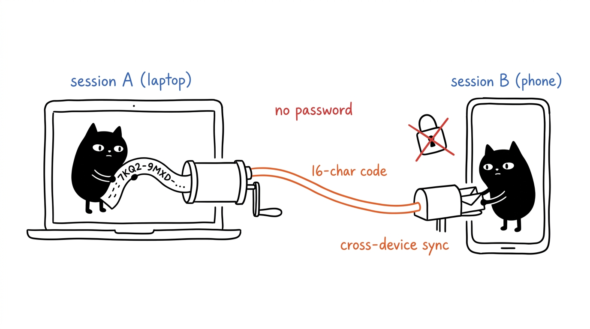

# Disposable Temp Mail API

Disposable Temp Mail exposes a REST API for session management, inbox operations, and message retrieval. All endpoints live under `/api/`.

**Base URL:** `https://YOUR_DOMAIN/api/`

---

## Authentication

Disposable Temp Mail uses **anonymous session tokens** — no login required.

1. Call `GET /api/session` to obtain a `sessionId`
2. Pass `x-session-id` header on all subsequent requests
3. Inboxes are scoped to the session: Browser A cannot see Browser B's inboxes

---

## Endpoints

### GET `/api/config`

Returns the public app configuration.

**Headers:** none

**Response** `200 OK`

```json
{
  "appName": "Disposable Temp Mail",
  "mailDomain": "example.com",
  "mailDomains": ["example.com", "another-domain.my.id"],
  "webHost": "tmail.example.com",
  "retentionOptions": [7, 30, 90],
  "defaultRetentionDays": 7
}
```

| Field | Type | Description |
|---|---|---|
| `appName` | string | App display name |
| `mailDomain` | string | Default mail domain (first in the list, for backward compat) |
| `mailDomains` | string[] | All available mail domains |
| `webHost` | string | Web frontend hostname |
| `retentionOptions` | number[] | Keep-for choices in days (`7`, `30`, `90`); `"keep"` (until removed) is always allowed too |
| `defaultRetentionDays` | number | Plan used when the client sends no `retentionDays` |

---

### GET `/api/session`

Creates or retrieves an anonymous browser session. If you pass an existing `x-session-id`, it returns the same ID. If you don't, it generates a new one.

**Headers**

| Header | Required | Description |
|---|---|---|
| `x-session-id` | No | Existing session ID (UUID v4). Omit to create a new session. |

**Response** `200 OK`

```json
{
  "sessionId": "550e8400-e29b-41d4-a716-446655440000"
}
```

**Usage**

```bash
# Create a new session
curl -s https://YOUR_DOMAIN/api/session

# Reuse an existing session
curl -s https://YOUR_DOMAIN/api/session \
  -H "x-session-id: 550e8400-e29b-41d4-a716-446655440000"
```

---

### GET `/api/inboxes`

Lists all inboxes linked to your session.

**Headers**

| Header | Required | Description |
|---|---|---|
| `x-session-id` | **Yes** | Session ID from `/api/session` |

**Response** `200 OK`

```json
[
  {
    "address": "kopihujan23@example.com",
    "created_at": "2026-06-26 07:48:19",
    "retention_days": 7,
    "transferCode": "7KQ2-9MXD-4PWA-8ZTH"
  }
]
```

Each inbox carries a `transferCode` — enter it on another device via
`POST /api/inboxes/claim` to shelve the same inbox there. No account needed.

**Errors**

| Status | Message | Meaning |
|---|---|---|
| `400` | `Missing x-session-id` | No session header provided |

**Usage**

```bash
curl -s https://YOUR_DOMAIN/api/inboxes \
  -H "x-session-id: 550e8400-e29b-41d4-a716-446655440000"
```

---

### POST `/api/inboxes`

Creates a new inbox (or claims an existing one) and links it to your session.

**Headers**

| Header | Required | Description |
|---|---|---|
| `x-session-id` | **Yes** | Session ID |
| `Content-Type` | Yes | `application/json` |

**Request Body**

| Field | Required | Description |
|---|---|---|
| `localPart` | No | Custom username (e.g. `"myname"`). Omit for a random address. |
| `retentionDays` | No | Keep-for plan: `7`, `30`, `90`, or `"keep"` (until you remove it). Defaults to `7`. Invalid values are rejected with `400`. |

| `domain` | No | Domain override. Must be one of the allowed domains from `GET /api/config`'s `mailDomains`. Defaults to the first configured domain. Invalid domains are rejected with `400`. |
| `turnstileToken` | Conditionally | Turnstile client token. **Required** when the server has `TURNSTILE_SITE_KEY` configured (the web UI attaches it automatically). Missing → `400`, failed verification → `403`. |

**Examples**

```json
// Custom address on default domain
{ "localPart": "myinbox" }
// → myinbox@example.com

// Random address
{}
// → langitbiru23@example.com

// Custom address on specific domain
{ "localPart": "test", "domain": "another-domain.my.id" }
// → test@another-domain.my.id

// Random on specific domain
{ "domain": "another-domain.my.id" }
// → melatijaya87@another-domain.my.id

// 30-day plan, or keep until removed
{ "retentionDays": 30 }
{ "retentionDays": "keep" }

// Invalid domain → 400
{ "domain": "evil.com" }
// → { "error": "Invalid domain: evil.com. Allowed: example.com, another-domain.my.id" }
```

**Response** `201 Created`

```json
{
  "address": "langitbiru23@example.com",
  "created_at": "2026-06-26 07:48:19",
  "retention_days": 7,
  "transferCode": "7KQ2-9MXD-4PWA-8ZTH"
}
```

**Errors**

| Status | Message | Meaning |
|---|---|---|
| `400` | `Missing x-session-id` | No session header provided |
| `400` | `Invalid domain: ...` | Requested domain is not in the allowed list. Check `GET /config`'s `mailDomains`. |
| `400` | `Captcha verification required` | Turnstile is enabled but no `turnstileToken` was sent |
| `403` | `Captcha verification failed` | Turnstile token rejected by Cloudflare |
| `429` | `Rate limit exceeded...` | Per-session (default 20/hr) or per-IP (default 30/hr) inbox cap hit. `Retry-After` header included |

**Notes**
- If the address already exists, it simply links the existing inbox to your session
- Random addresses are human-readable Indonesian-style (e.g. `kopihujan42`, `bulanbiru17`)
- The generator checks the actual database for uniqueness — it never creates duplicates, even across different sessions

**Usage**

```bash
# Create with custom name
curl -s -X POST https://YOUR_DOMAIN/api/inboxes \
  -H "x-session-id: 550e8400-e29b-41d4-a716-446655440000" \
  -H "Content-Type: application/json" \
  -d '{"localPart":"myinbox"}'

# Create random
curl -s -X POST https://YOUR_DOMAIN/api/inboxes \
  -H "x-session-id: 550e8400-e29b-41d4-a716-446655440000" \
  -H "Content-Type: application/json" \
  -d '{}'
```

---

### POST `/api/inboxes/claim`

Links an inbox filed on another device to your session using its transfer
code. The code is shown in the reading room under the selected inbox
(`XXXX-XXXX-XXXX-XXXX`, 80-bit Crockford base32 — safe to type by hand).

**Headers**

| Header | Required | Description |
|---|---|---|
| `x-session-id` | **Yes** | Your session ID (the *other* device's session is not needed) |
| `Content-Type` | Yes | `application/json` |

**Request Body**

| Field | Required | Description |
|---|---|---|
| `code` | **Yes** | Transfer code. Case-insensitive; hyphens and spaces optional. |

**Response** `200 OK`

```json
{
  "address": "langitbiru23@example.com",
  "created_at": "2026-06-26 07:48:19",
  "retention_days": 7,
  "transferCode": "7KQ2-9MXD-4PWA-8ZTH"
}
```

**Errors**

| Status | Message | Meaning |
|---|---|---|
| `400` | `Missing x-session-id` | No session header provided |
| `400` | `Invalid transfer code format` | Code is malformed |
| `404` | `No inbox matches that transfer code` | Unknown or already-purged inbox |
| `429` | Rate limit exceeded | 30 claims/IP/hour (see `Retry-After`) |

**Usage**

```bash
curl -s -X POST https://YOUR_DOMAIN/api/inboxes/claim \
  -H "x-session-id: 550e8400-e29b-41d4-a716-446655440000" \
  -H "Content-Type: application/json" \
  -d '{"code":"7KQ2-9MXD-4PWA-8ZTH"}'
```

---

### POST `/api/inboxes/:address/renew`

Restarts the inbox's retention clock (`created_at` = now). Must be linked to your session.

**Response** `200 OK` — the inbox with its new `created_at`.

```bash
curl -s -X POST "https://YOUR_DOMAIN/api/inboxes/test123%40example.com/renew" \
  -H "x-session-id: 550e8400-e29b-41d4-a716-446655440000"
```

---

### PATCH `/api/inboxes/:address/retention`

Changes the inbox's retention plan going forward. Must be linked to your session.

**Request Body**

| Field | Required | Description |
|---|---|---|
| `retentionDays` | **Yes** | `7`, `30`, `90`, or `"keep"` (until you remove it). Anything else → `400`. |

```bash
curl -s -X PATCH "https://YOUR_DOMAIN/api/inboxes/test123%40example.com/retention" \
  -H "x-session-id: 550e8400-e29b-41d4-a716-446655440000" \
  -H "Content-Type: application/json" \
  -d '{"retentionDays":"keep"}'
```

**Notes**
- `retention_days: null` in responses means keep-until-removed: the address never expires on its own. Ledger entries are a separate clock — every message is deleted 90 days after arrival on any plan, so the database can't grow forever.
- Changing the plan does not restart the clock — use `renew` for that.

---

### DELETE `/api/inboxes/:address`

Removes an inbox from your session. Does **not** delete the inbox or its messages from the database — it just unlinks it from your session so it no longer appears in your list.

**Headers**

| Header | Required | Description |
|---|---|---|
| `x-session-id` | **Yes** | Session ID |

**Path Parameters**

| Param | Description |
|---|---|
| `address` | Full email address, URI-encoded. Example: `test123%40example.com` |

**Response** `200 OK`

```json
{ "ok": true }
```

**Errors**

| Status | Message | Meaning |
|---|---|---|
| `400` | `Missing x-session-id` | No session header |

**Usage**

```bash
curl -s -X DELETE "https://YOUR_DOMAIN/api/inboxes/test123%40example.com" \
  -H "x-session-id: 550e8400-e29b-41d4-a716-446655440000"
```

---

### DELETE `/api/messages/:id`

Permanently deletes a single message from the database. Only works for messages in an inbox linked to your session — other sessions' messages return `404`, so one session can never strike another's entries.

**Headers**

| Header | Required | Description |
|---|---|---|
| `x-session-id` | **Yes** | Session ID |

**Path Parameters**

| Param | Description |
|---|---|
| `id` | Message ID, URI-encoded |

**Response** `200 OK`

```json
{ "ok": true }
```

**Errors**

| Status | Message | Meaning |
|---|---|---|
| `400` | `Missing x-session-id` | No session header |
| `404` | `Message not found` | Unknown ID, or message belongs to another session's inbox |

**Usage**

```bash
curl -s -X DELETE "https://YOUR_DOMAIN/api/messages/01JABC123XYZ" \
  -H "x-session-id: 550e8400-e29b-41d4-a716-446655440000"
```

---

### GET `/api/inboxes/:address/messages`

Fetches all messages for a given inbox. The inbox must be linked to your session.

**Headers**

| Header | Required | Description |
|---|---|---|
| `x-session-id` | **Yes** | Session ID |

**Path Parameters**

| Param | Description |
|---|---|
| `address` | Full email address, URI-encoded. |

**Response** `200 OK`

```json
[
  {
    "id": "msg_1782461413912_0956a83c",
    "inbox_address": "test123@example.com",
    "from_address": "someone@gmail.com",
    "subject": "Hello",
    "body": "This is the email body",
    "hasHtml": true,
    "attachments": [
      { "id": "att_9f2c1a", "filename": "invoice.pdf", "mime_type": "application/pdf", "size": 48210, "cid": null, "inline": false }
    ],
    "received_at": "2026-06-26 08:10:14"
  }
]
```

`hasHtml` marks a sanitized rich version (see `GET /api/messages/:id/html`); raw `body_html` is never inlined in the list. `attachments` is metadata only — bytes download per file. Caps: 5 files per message, 5 MB per file, 10 MB total; oversized parts are dropped with a log line.

**Errors**

| Status | Message | Meaning |
|---|---|---|
| `400` | `Missing x-session-id` | No session header |
| `403` | `Inbox not in this session` | The inbox exists but is not linked to your session. Use `POST /api/inboxes` with the matching `localPart` to claim it first. |

**Usage**

```bash
curl -s "https://YOUR_DOMAIN/api/inboxes/test123%40example.com/messages" \
  -H "x-session-id: 550e8400-e29b-41d4-a716-446655440000"
```

---

### GET `/api/messages/:id/html`

Returns the sanitized rich-HTML version of a message (`text/html`). Session-scoped like everything else. The web reader renders this only inside a sandboxed iframe; if you embed it yourself, keep it sandboxed — treat it as untrusted sender content. Returns an empty body when the mail had no HTML part.

**Errors**

| Status | Message | Meaning |
|---|---|---|
| `400` | `Missing x-session-id` | No session header |
| `404` | `Message not found` | Unknown id, or not in your session |

---

### GET `/api/attachments/:id`

Downloads one attachment's bytes. Always served as `Content-Disposition: attachment` with `nosniff`, so even SVG/HTML payloads stay inert. Session-scoped; inline images (`cid:`) resolve through this same endpoint.

**Errors**

| Status | Message | Meaning |
|---|---|---|
| `400` | `Missing x-session-id` | No session header |
| `404` | `Attachment not found` | Unknown id, not in your session, or bytes already purged |
| `501` | `Attachments not configured` | No R2 bucket bound (self-hosted without R2) |

---

## Full flow example

```bash
DOMAIN="tmail.YOURDOMAIN.com"

# 1. Get session
SESSION=$(curl -s https://$DOMAIN/api/session | jq -r '.sessionId')

# 2. Create an inbox
INBOX=$(curl -s -X POST https://$DOMAIN/api/inboxes \
  -H "x-session-id: $SESSION" \
  -H "Content-Type: application/json" \
  -d '{}' | jq -r '.address')
echo "Created: $INBOX"

# 3. ...wait for an email to arrive...

# 4. List inboxes
curl -s https://$DOMAIN/api/inboxes -H "x-session-id: $SESSION" | jq '.'

# 5. Read messages
ENCODED=$(echo -n "$INBOX" | jq -sRr '@uri')
curl -s "https://$DOMAIN/api/inboxes/$ENCODED/messages" \
  -H "x-session-id: $SESSION" | jq '.'

# 6. Delete inbox from session
curl -s -X DELETE "https://$DOMAIN/api/inboxes/$ENCODED" \
  -H "x-session-id: $SESSION"
```

---

## Errors

All error responses follow this format:

```json
{
  "error": "Human-readable error message"
}
```

| Status | When |
|---|---|
| `400` | Missing `x-session-id` header, or invalid domain in POST `/api/inboxes` |
| `403` | Unauthorized — inbox not linked to your session |
| `404` | Route not found |
| `429` | Rate limit exceeded — 20 inboxes/session/hour, 10 sessions/IP/hour, 30 claims/IP/hour (see `Retry-After`) |

---

## Session isolation



Disposable Temp Mail uses per-browser anonymous sessions:

| Scenario | Behavior |
|---|---|
| New browser | Empty inbox list |
| After creating inbox A | Only inbox A appears in that browser |
| Open in incognito | Empty — different session |
| Refresh same browser | Inboxes persist (via `localStorage`) |
| Send email to inbox A | Inbox A gets it instantly (email handler auto-creates inbox record) |
| Enter inbox A's transfer code on a second device | Inbox A appears there too — same mailbox, both browsers |
